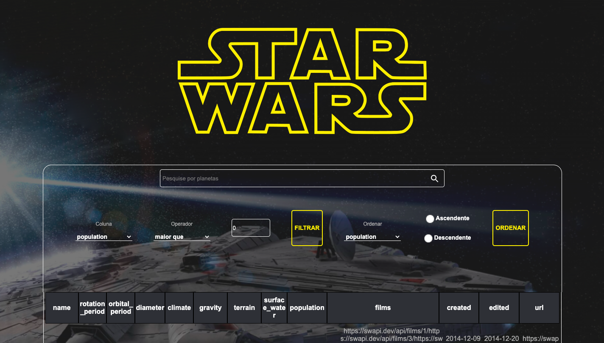
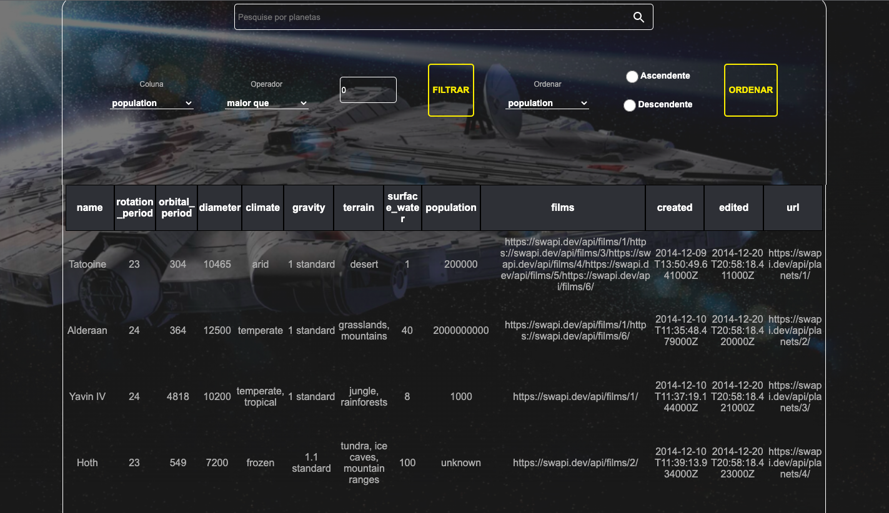
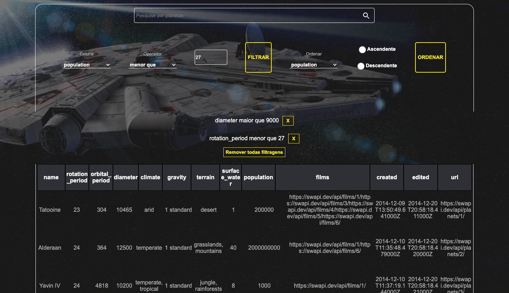

# StarWars Planets Search

StarWars Planets Search is a filter list of planets from the Star Wars universe using Context API and Hooks to control global states. This application is capable of:

- add and remove filters;
- accumulate filters;

<div align="center" display="inline">




</div>

## Run Locally:
- First clone the repository into your machine;

```
git clone git@github.com:GabiNamu/starwars-planets-search.git
```
- Go to the project directory;

```
cd starwars-planets-search
```

- Install dependencies;

```
npm install
```
- Start the server;
```
npm start
```
## Main technologies used:
- React;
- Hooks;
- Context API;
- JavaScript;
- Css;
